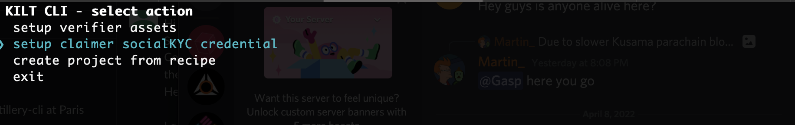
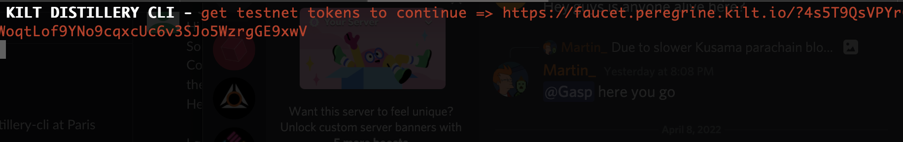
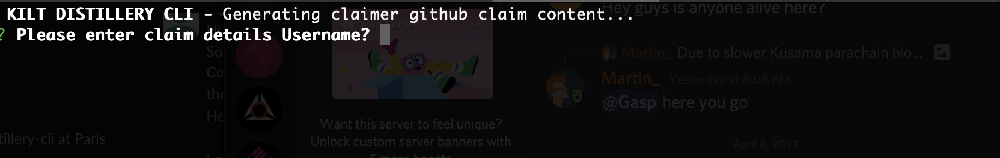
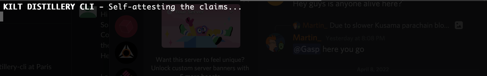

# kilt-distillery-cli
CLI tool to help devs quickly accomplish commons tasks and get started with project recipes

## disclaimer
This tool is in beta and intended to ease development efforts, not as a replacement for production code. 

## install
### locally on your repository
`npm install git+https://github.com/KILTprotocol/kilt-distillery-cli`  

or

`yarn add git+https://github.com/KILTprotocol/kilt-distillery-cli`  
 

## run
from the terminal  
`kilt-distillery-cli`  
or 
`yarn run start`

## Setup Claimer Flow

The Claimer CLI tool allows you to create self-attested socialKYC on the peregrine test network. It helps speed up the testing of utilities such as web3 login or credential access on a project by running through the CLI and producing credentials in minutes.

Here are the steps to create your claimer's self-attested SocialKYC credentials.

First, you will need to clone and follow the installation steps in the KILT Distillery CLI. 

Afterwards, you can run the following command inside the folder or project you wish to store the credentials

```js
kilt-distillery-cli
```

Accessing the KILT CLI, choose setup claimer socialKYC credentials



Enter a test mnemonic you wish to use for the credentials. Make sure to note down the mnemonic for future steps.

 *** ONLY USE TEST MNEMONICS; IT IS NOT SAFE OVERWISE AS IT IS ONLY FOR TEST PURPOSES***

If the mnemonic doesn’t already have tokens, it will check the balance and request tokens from the KILT Faucet



Once the tokens have been requested, the script will continue to create a DID for the newly generated account or pull a preexisting DID based on the sporran DID creation.

Afterwards, the script will prompt you to enter some claimer details



Enter the desired claimer details for testing for each of the available socialKYC CTypes check out the GitHub repository. For more information on what is available, check out the socialKYC. 

Once you have entered the claimers' details, the self-attestation process will happen.



Congratulation, you have created the claims and will have a folder called `claimer-credentials` with all the JSON files. Using any editor, you can now view the credential.

```JSON
{
  "attester": "PeregrineSelfAttestedSocialKYC",
  "cTypeTitle": "peregrine discord",
  "isDownloaded": true,
  "name": "peregrine discord",
  "request": {
    "claim": {
      "cTypeHash": "0xd8c61a235204cb9e3c6acb1898d78880488846a7247d325b833243b46d923abe",
      "contents": {
        "Username": "as",
        "Discriminator": "d",
        "User ID": "ad"
      },
      "owner": "did:kilt:4o3zUbeEowBHbAu4aLsNXyNQHEw16KZbinLyd6BwXVkzdJKn"
    },
    "claimHashes": [
      "0x017c53fe300a6a21f0744bb945c4914953a072feac321377e58664d793ff397c",
      "0x64e8b2c573c6ea39e0500e88158c285d4646aefc0a9bc4e5650deef9bf389c50",
      "0x70aedfe3f056c305e66887096167311457cc4670c5204666f96c05b2aa273f71",
      "0xd5d1302a496c90783f38e63afc8ef952afb3f869ba6b7f8d4536a3715a9d0c38"
    ],
    "claimNonceMap": {
      "0xd9e25d9bd0eb9e982ca3b985c07a119a5838c9ab670076914002ed5ace6a2604": "f7b9ab2a-4d09-4dae-8c25-214d68574d13",
      "0x432f7675313a57ab6eccca388e7c97e659b5cd48ae4c2f86d16cc61721bc426a": "e2059d2e-5c8b-42e5-be61-d4809c027bac",
      "0x38e3261ff9be4b7be16a6f274723f9ccf0d0dc0b3a1f3dc52d3a6ce78519e0a2": "11892da5-f1e5-4652-a76e-5f7d0b8058ae",
      "0x47b5ba7270b485bc5f629bd032971cd240ebba0db10e0b84f263b6f5eb6f0ce5": "bd227dc4-1d82-4ab7-b1ca-6ae75b986f88"
    },
    "legitimations": [],
    "delegationId": null,
    "rootHash": "0x9a0aa9b4f6a5d71fa62bdf2cc441e892340c951c5486a7117dd2dd1245caa3cc",
    "claimerSignature": {
      "signature": "0xb039fcc56590f275f4012d146781414985f36bc896b0d701d1acff9503db3f5dc937e9f9f2c81256995937ada7f99c0db44c85249006dabe01b6dad2e9da8e88",
      "keyId": "did:kilt:4o3zUbeEowBHbAu4aLsNXyNQHEw16KZbinLyd6BwXVkzdJKn#0x5e7ea14081452641c4970081552f774d4b2495ce918ddc0e35fd50735e5d7e1c"
    }
  },
  "attested": true
}
```

Now the last thing, you can import them directly into the developer version of sporran along with the mnemonic used.

If you do not have the developer sporran or a wallet that accepts KILT credentials follow the sporran instructions on how to create a developer wallet. 

How does web3 login work? Check out our recipe Credential login or DID login.
